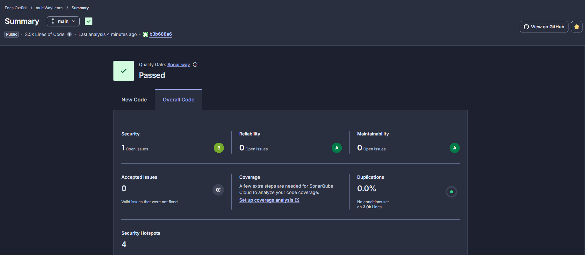

# MultiWayLearn

> **6 Sefer Tekrar Prensibi** ile İngilizce kelime öğrenme platformu

[](https://sonarcloud.io/summary/new_code?id=DevVettel_multiWayLearn)
[](https://sonarcloud.io/summary/new_code?id=DevVettel_multiWayLearn)
[](https://sonarcloud.io/summary/new_code?id=DevVettel_multiWayLearn)
[](https://sonarcloud.io/summary/new_code?id=DevVettel_multiWayLearn)

---

## Proje Hakkında

**MultiWayLearn**, bilişsel pekiştirme araştırmalarına dayanan **aralıklı tekrar (spaced repetition)** algoritması kullanarak İngilizce kelimeleri kalıcı belleğe yerleştiren bir web uygulamasıdır.

Bir kelime "öğrenildi" sayılmak için 6 farklı zaman diliminde arka arkaya doğru yanıtlanması gerekir:

| Aşama | Süre |
|-------|------|
| 1. tekrar | 1. gün |
| 2. tekrar | 2. gün |
| 3. tekrar | 9. gün |
| 4. tekrar | 40. gün |
| 5. tekrar | 131. gün |
| 6. tekrar | 313. gün |

6. aşamayı geçen kelime otomatik olarak "Öğrenildi" havuzuna taşınır.

---

## Özellikler

| Modül | Açıklama |
|-------|----------|
| Kimlik Doğrulama | Kayıt, giriş, JWT tabanlı oturum yönetimi |
| Kelime Yönetimi | Kelime ekleme, resim ve örnek cümle desteği |
| Spaced Repetition Quiz | 6 aşamalı aralıklı tekrar algoritması |
| Seviye Sistemi | A1 / A2 / B1 seviyeleri, ilerlemeye göre kilit açma |
| Wordle Modu | 5 harfli günlük Wordle bulmacası |
| Analiz & İstatistik | Günlük hedef takibi, öğrenme raporu |
| Word Chain | LLM destekli (Google Gemini) hikaye üretimi |
| Kullanıcı Ayarları | Günlük kelime hedefi kişiselleştirme |

---

## Teknoloji Yığını

| Katman | Teknoloji |
|--------|-----------|
| Frontend | React 19 · Vite · Tailwind CSS |
| Backend | Node.js · Express |
| Veritabanı | SQLite · better-sqlite3 |
| ORM | Prisma |
| Kimlik Doğrulama | JWT · bcrypt |
| LLM | Google Gemini API |
| Kod Kalitesi | SonarCloud |

---

## Proje Yapısı

```
multiWayLearn/
├── frontend/               # React uygulaması (Vite)
│   └── src/
│       ├── components/     # UI bileşenleri
│       ├── pages/          # Sayfa görünümleri
│       └── services/       # API istemcisi
├── backend/                # Node.js + Express API
│   ├── routes/             # Endpoint tanımları
│   ├── middleware/         # Auth & doğrulama
│   ├── database/           # SQLite bağlantısı
│   └── utils/              # Paylaşılan yardımcılar
├── docs/                   # Proje görselleri
└── README.md
```

---

## Kurulum

### Gereksinimler

- Node.js 18+
- npm 9+

### Backend

```bash
cd backend
npm install
cp .env.example .env   # JWT_SECRET ve GEMINI_API_KEY ekle
npm start
```

### Frontend

```bash
cd frontend
npm install
npm run dev
```

Uygulama `http://localhost:5173` adresinde çalışır; API `http://localhost:3001` portunu kullanır.

---

## Kod Kalitesi — SonarCloud

Proje, SonarCloud ile sürekli statik analiz altındadır. En son Quality Gate sonucu:



| Boyut | Durum |
|-------|-------|
| Quality Gate | **Passed** |
| Güvenlik | A (0 açık konu) |
| Güvenilirlik | A (0 açık konu) |
| Bakım Kolaylığı | A (0 açık konu) |
| Kod Tekrarı | 0.0% |

---

## Scrum Board

Görev takibi Trello üzerinden yürütülmektedir:

[Trello — MultiWayLearn Scrum](https://trello.com/b/KIh25VLx/wordmaster-scrum)

---

## Ekip

| İsim | GitHub |
|------|--------|
| Enes Öztürk | [@DevVettel](https://github.com/DevVettel) |
| Okan Varol | [@okantao](https://github.com/okantao) |
